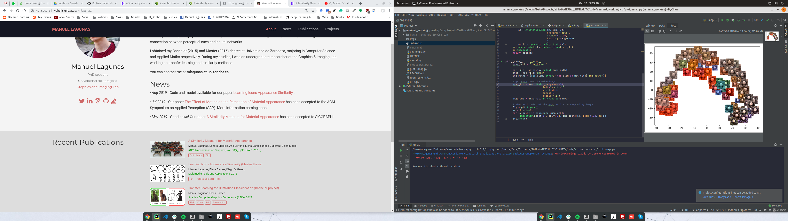

<div align="center">  
  
# A Similarity Measure for Material Appearance   
[](http://webdiis.unizar.es/~mlagunas/publication/material-similarity/)
[](http://webdiis.unizar.es/~mlagunas/papers/similarity_siggraph_19_small.pdf)
[](https://dl.acm.org/citation.cfm?id=3323036)
[](https://dl.acm.org/citation.cfm?id=3323036)

</div>

## Abstract   
We present a model to measure the similarity in appearance between different materials, which correlates with human similarity judgments. We first create a database of 9,000 rendered images depicting objects with varying materials, shape and illumination. We then gather data on perceived similarity from crowdsourced experiments; our analysis of over 114,840 answers suggests that indeed a shared perception of appearance similarity exists. We feed this data to a deep learning architecture with a novel loss function, which learns a feature space for materials that correlates with such perceived appearance similarity. Our evaluation shows that our model outperforms existing metrics. Last, we demonstrate several applications enabled by our metric, including appearance-based search for material suggestions, database visualization, clustering and summarization, and gamut mapping.

## Setting it up   
_Note that this has been tested using python 3.7_

### Dependencies
First, clone and install dependencies   
```bash
# clone project   
git clone https://github.com/mlagunas/material-appearance-similarity.git   

cd material-appearance-similarity 
pip install scipy numpy matplotlib umap-learn Pillow
# install pytorch/torchvision (https://pytorch.org)
 ```   

Get model pretrained weights
- download model [weights](https://drive.google.com/file/d/1lAkmIRTLgFXjgO5PQ7NNOCYQeNh0JH-N/view?usp=sharing)
- download some [test images](https://drive.google.com/file/d/1SAHOwnFLHhJAk_84zPlJ84dAmYl2TAdJ/view?usp=sharing)
- download [all images](https://drive.google.com/file/d/1v7hQHIrLZYocn-rW9kalVQP8wYQ6Kg3x/view?usp=sharing)

## How to run the code  

### Getting image feature vectors

Next, get the feature vectors for some images. First, modify paths inside `get_embs.py`.
```python
...
weights_path = 'data/model_best.pth.tar'
imgs_path = 'data/havran1_stpeters_256x256_LDR'
embs_path = 'data/embs.mat' # we will store the obtained feature vectors in this path
...
```

Then, get the feature vectors for the downloaded images
```bash
python3 get_embs.py    
```

### Get similar images
We can obtain similar images to a given reference using the previously computed feature vectors. First, set the path and necesary variables in `plot_similar.py`. This will store the 5 more similar images to the reference according to our metric in the path `data/nickel`.
```python
...
embs_path = 'data/embs.mat'  # /mat file with the embeddings
n_close_elems = 5  # number of close elements to find
reference_img = 'data/havran1_stpeters_256x256_LDR/nickel.png'
...
```
<div align="center">  

</div>

### Generate UMAP plot

We can visualize the feature vectors generated for the images using dimensionality reduction algorithms like UMAP. 
First we set the path of the feature vectors inside `plot_umap.py`. 
```python
...
embs_path = 'data/embs.mat'
...
```
To generate the plot we run:
```bash
python3 plot_umap.py
```
<div align="center">  

</div>

## Citation   
If you found this code useful please cite our work as:
```
@article{lagunas2019similarity,
    author = {Lagunas, Manuel and Malpica, Sandra and Serrano, Ana and
    Garces, Elena and Gutierrez, Diego and Masia, Belen},
    title = {A Similarity Measure for Material Appearance},
    journal = {ACM Transactions on Graphics (SIGGRAPH 2019)},
    volume = {38},
    number = {4},
    year = {2019}
}
```   
